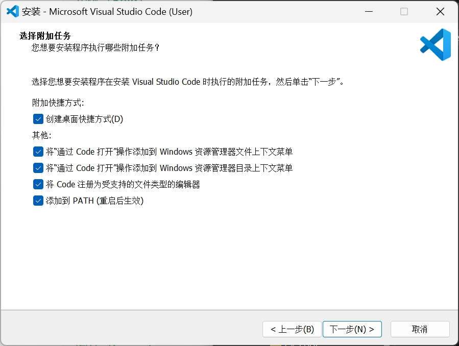

本篇内容将对 **环境配置** 作详细说明  
通过阅读此内容可以进行一次完整的烧录过程，而对于非 **本开源项目** 中所提及的 [HinarUI / 原生PCB部署配置](http://link2hinar.fun/p/hinarui_pcb_deploy/) 的部署教程请阅读 [HinarUI / 自定义MCU部署配置](http://link2hinar.fun/p/hinarui_custom_mcu_deploy/)

## 前置环境需求
首先需要自行检查前置软件是否安装，如已安装可跳过对应部分

### Python
`PlatformIO` 依赖 `Python` 环境进行安装，故此处需要先检查是否存在本地环境

安装 `Python` 可通过如下两种方式进行：  

1. 访问 https://www.python.org/downloads/ 官网获取软件包
2. 如无法访问，可在此处 https://pan.quark.cn/s/91a389f79341 找到 `python-3.13.5-amd64.exe`

在安装界面记得勾选 `将 Python 加入 PATH` 的选项

### VS Code && PlatformIO
`HinarUI` 基于 `VS Code` 平台的插件 `PlatformIO` 进行开发，所使用的框架为 `Arduino` 样式  
故此处需要确保有安装如上所提的内容  

> **注意**: 如已安装 `VS Code` ，后续部分打开代码文件夹时会弹出推荐安装 `PlatformIO` ，也可选择在此时直接点击安装键并跳过这一部分  

安装 `VS Code` 可通过如下两种方式进行：  

1. 访问 https://code.visualstudio.com/Download 官网获取软件包
2. 如无法访问，可在此处 https://pan.quark.cn/s/91a389f79341 找到 `VSCodeUserSetup-x64-1.102.1.exe`

双击打开下一步全部勾选安装，效果如下：

> 安装完成后可选 重启 使PATH生效，但并不强制需求

安装 `PlatformIO`:

1. 在侧边栏找到 **扩展(Ctrl + Shift + x)**
2. 搜索 `PlatformIO` 并安装

非常好的插件，故说实话即使你后面什么都不做，你只要打开我的项目他就会自动配置

### Git (可选)
如有兴趣参与本项目的开源共同设计可以安装 `Git` fork一份进行协同开发，不过都懂这个了应该也不需要我来讲一遍怎么安装了吧)

## 编译并烧录
请在确保已含有上述前置软件的基础上阅读以下部分，如遇到缺少前置软件提醒请自行辨明处理

本项目主目录适用于作为库文件于 `library` 目录下引用并开发，目前阶段推荐使用 `example` 目录下的完整项目进行烧录测试，此处以后者作为演示  

本项目文件可以从如下两种方式获取：
1. 访问 https://github.com/890mn/HinarUI/releases/ 下载 `Source code` 版本
2. 如无法访问，可在此处 https://pan.quark.cn/s/91a389f79341 找到 `HinarUI-main-#` 为前缀的文件并下载

获取源文件后按照如下步骤进行配置：
1. 使用 `VS Code` 打开 `/example` 子目录
2. 此时
    1. 如未安装 `PlatformIO` 则会自动推荐安装，点击即可
    2. 已安装可以无视此条过程
3. `PlatformIO` 在首次打开时会自动进行安装配置，需耐心等待安装过程直至 `restart VS Code` 弹窗提示出现

> 可打开 Help -> Toggle Developer Tools 查看Debug输出

4. 安装完毕后可在左下角或右上角看到类似 `✔️` `➡️` 分别代表 **编译** 和 **烧录**
5. 使用一根带有Type-C公头的数据线将 `HinarUI PCB` 与电脑连接，如无问题则会在左下角显示对应串口编号 [请检查是否装有CH340串口驱动]
6. 点击烧录按键 `➡️` 或者 快捷键 (Ctrl + Alt + U) 并等待完成

如果以上步骤都顺利完成，那么恭喜你，你应该能够看到UI界面了！

[🔙 点击此处可以返回主目录浏览](https://link2hinar.fun/p/hinarui/)